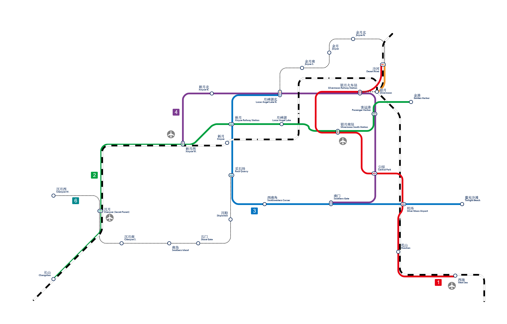

# 银月市

## 概述

- 银月市是位于[新光](/docs/SurvivalIII/xinguang/xinguang.md)西北的一座建设中的城市，以一片完全新建的海港为中心向内陆方向西拓，目前的发展方向为以旅游业和商业为主，重轻工业为辅。
- 银月的建设愿景是成为「新光级的大城」,有发展为新光建成以后的第二大主城的希望。
- 和新光一样，银月实行公有制。北境的资源共享区域位于银月区银月客运港西。正式的仓库建设中。
  > 在新光境内，实行公有制，所有玩家都可以任取城镇内的资源（不包括管制资源和未明确说明「资源可自取」的住宅内的资源）。但所有玩家也应当有自觉意识，例如不得过多取走珍贵物资。在新光境内生活的玩家们应当持有分享开放精神。
  >
  > 更多规则请参考[银月管理条例](silvermoon_administrative_regulations.md)。

## 历史

- 银月（最初称为北境）的始建者为 ~~@Demonioron (De)~~，大约于 2023 年 5~6 月间加入测试群并随后进入生存服，提出「密林谷」的建设计划并最终得以实施，建设过程中逐渐扩展并更名为北境。但此人曾多次对群集体有一定攻击性发言，现已被驱逐。  
  此人后续曾以 ~~@Jsa~~ 的身份试图再次入群并隐瞒身份散播谣言，已退群。
- 银月目前的地委书记是 @巴豆 和 @比翼鸟，后者于 2023 年 8 月 3 日开始接手北境建设。**当前银月的各项目建设，原则上均应与以上二人之一事先声明方可进行。**

## 行政区划

### [皓月区](haoyue_district.md)

银月市的中心城区。

### [新月区](xinyue_district.md)

银月的老城区，现阶段处于再开发时期。

### [沉月区](chenyue_district.md)

银月的西郊区，原名「密林谷」。

### [金月区](jinyue_district.md)

银月的北郊区。

## 主要建筑

### 银月火车站

1、2 站台为港湾式站台，分别为月矿线和规划中月原线的终点站；3、4 站台为侧式站台，为建设中的月岩线的终点站。

### 银月客运港

纯粹的客运用途的海港，目前开行「银月 — 新光」北港的航线。北侧有观光灯塔。

### 工厂

- 一厂为刷石机工厂。
- 二厂有三层，一层为自动化农场，二层为炼油厂（无限岩浆源），三层为两台自动化转炉。
- 三厂建设中。

### 公园

位于城南，一个平凡的小公园。

### 银月 ~~（国际？）~~ 机场

由比翼鸟承建的机场，计划提供向新光、矿山、雪原等地的航班服务。

## 重点工程

### 地形修复

目前银月市区已开发地带和原有自然地形之间并无过渡地形，一刀切的高地断面严重影响市容，因此需要修整这些断崖地形以使得地形平滑。

### 银月自强计划

建设银月市能够自给自足的各种资源，使银月市可以真正作为一个独立的市存在下去。

## 铁路规划

- **1 号线**：沙河 — 新光外环，「机场（不含） — 西海」贯通国铁月矿线，在沙河站/银月北线路所接入月原线，新光外环站与新光地铁 4 号线换乘，共 8 站；
- **2 号线**：金港 — 长山，「新月（不含） — 长山（不含）」段贯通国铁月岩线，共 8 站；
- **3 号线**：月神湖北 — 暮光沙滩，「南门 — 月神湖北」段与 4 号线建设联络线成环线，共 7 站；
- **4 号线**：南门 — 沉月，「月神湖北 — 南门」段与 3 号线建设联络线成环线，共 9 站;
- **5 号线**：银月火车站 — 林场，「银月火车站 — 新月（不含）」段贯通国铁月原线，共 9 站；
- **6 号线**：沉月西 — 银月南站，单线，共 9 站。

另外远期计划建设一条连接金港和暮光沙滩的磁悬浮铁路（具体的建设风格待定）。

