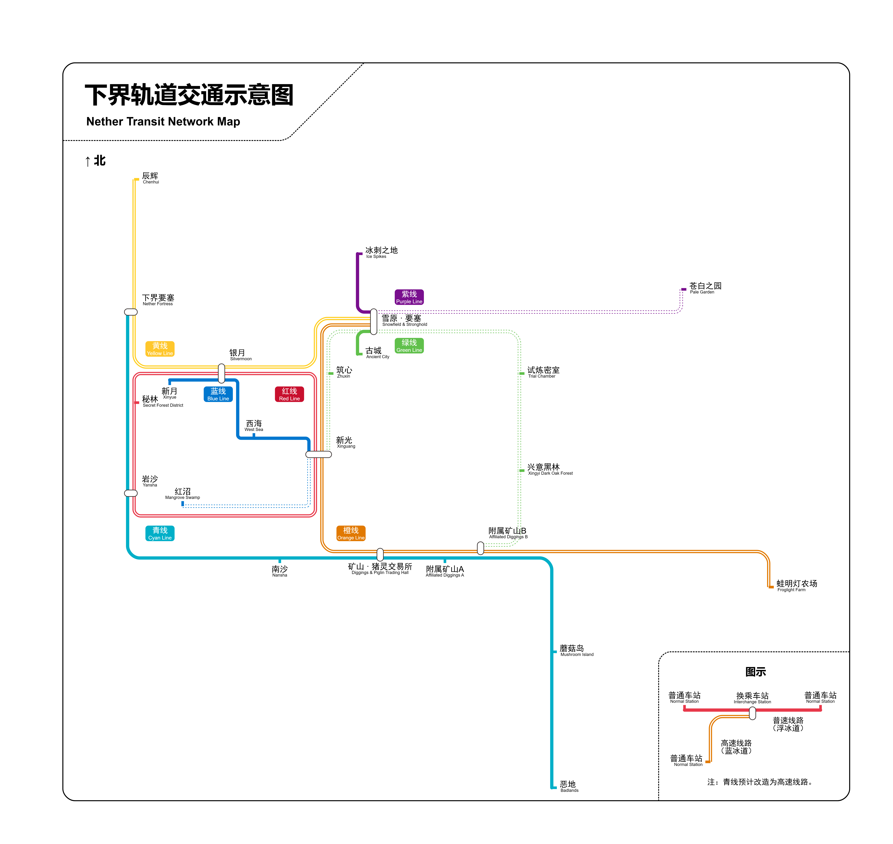

# 下界交通

> 提示  
该文章目前尚未经过格式规范审查。经其他审查员审查之后，该提示窗口将被移除。

下界交通系统是生存服中，利用下界与主世界空间转换关系而建成的庞大轨道交通系统，用于快速在各个世界中的重要点位间交流。

## 相关规定

下界交通系统基于[《新光市管理条例》](../xinguang_administrative_regulations.md)（以下简称「条例」）的第九条进行建设。

> **第九条** 下界交通建设标准 
（一）**本标准适用于全服所有发展区域。** 
（二）下界交通系统是建设于下界的，用于连接各个发展区域或重要地点的轨道交通系统。 
下界交通系统应设立多个站点，每个站点都应当有连接到主世界或进入下界的功能，不得增设无以上意义的下界站点。 
下界交通站点分为 3 类：「发展区域站点」、「资源站点」、「遗迹站点」。 
发展区域站点，是指各个发展区域对应位置的站点，默认为大型站点，一般也是大型枢纽。 
资源站点，是指能够产出或提供特定资源的对应站点，例如要塞或恶地。 
遗迹站点，是指对应到某些遗迹型地点的站点，例如古城。 
（三）下界交通站点的建设，必须采用任意防火型材料台阶的下半砖，或者玻璃作为地板，防止刷怪；并配备有充足的照明。 
应当做好站点内导向标识，在站台清楚地标记本站名称。 
所有告示牌均不得发光处理，不得使用过多告示牌，造成卡顿。 
对于小型站点，下界传送门或进入下界的通道可以铺设到和轨道同等的高度（即 115 格高）；对于大型枢纽站点或大型发展区域站点，下界传送门或进入下界的通道必须铺设到更低的位置（例如 95 格高）。 
（四）下界交通的轨道类型有两种，分别为宽 1 格的单向铁轨和宽 2 格的冰道，中间必须有玻璃板分隔。 
冰道上必须铺满石按钮，防止刷怪。 
轨道内应当添加光源，做好墙面装饰。 
站点内，冰道应当加设仙人掌，方便旅客快速卸船，并在旁边空出一部分的区域不放置按钮，用于放船。 
发展区域站点与发展区域站点之间的冰道应当使用蓝冰连接，其他轨道视情况使用浮冰或蓝冰，但非必要情况应当使用浮冰。 
矿车轨道应当使旅客到站后完全停止，不得继续加速。 
（五）下界交通的轨道必须建设于高度 115 的位置。 
不得出现不同高度或中途上下起伏。 
轨道之间不得出现交叉。 
对于不符合要求规定的高度应当重新规划，或者应当予以拆除。 
（六）未经 YZBWDLT 或指定下界交通建设者允许的情况下，任何人不得私自变动下界交通系统的站点或轨道布局。 
其他成员有权提出建设规划的意见，或者对站点本身进行装饰，但实际规划的权利和落实仅属于 YZBWDLT 或指定的下界交通建设者。

## 下界交通轨道示意图

截止于 2024 年 7 月 24 日，下界交通系统拥有 7 条线路， 17 个站点，于下界中的总里程超过 4000 米。

- **红线**：红线是贯通新光与银月两个重要发展地点的高速线路。采用蓝冰，拥有 4 个站点，长度约为 1000 米。
- **橙线**：橙线是贯通雪原、新光与矿山三个重要发展地点、也是连接到重要资源站点蛙明灯农场站的高速线路。采用蓝冰，拥有 5 个站点，长度约为 1220 米。
- **黄线**：黄线是贯通辰辉、银月和雪原两个重要发展地点的高速线路。采用蓝冰，拥有4个站点。
- **绿线**：绿线是从雪原连接到古城的线路。采用浮冰，拥有 2 个站点。长度约为 75 米。
- **青线**：青线是连接了矿山、岩沙和各个小站点的重要线路。采用浮冰，拥有 6 个站点，长度约为 1400 米。
- **蓝线**：蓝线是红线内部的一条用于连接特殊小站点的线路。采用浮冰，拥有 5 个站点。
- **紫线**：紫线是从雪原连接到冰刺之地的线路。采用浮冰，拥有 2 个站点，长度约为 130 米。

## 未来的发展规划

### 一期工程

- [ ] 新光站站台层与候车层的设计与建设
- [ ] 黄线建设完工
- [ ] 黄线里程估计
- [ ] 银月站整改完工
- [ ] 蓝线新增月光村站
- [ ] 蓝线建设南沙站
- [ ] 蓝线里程估计

### 二期工程

- [ ] 绿线延长至小意发展区站（名称待定）和附属矿山B站
- [ ] 青线升级为高速线路
- [ ] 新增通向最近的红树林沼泽、试炼密室的线路

### 主世界站点建设

- [ ] 冰刺之地站

## 你知道吗

- 下界交通自 2024 年的暑假经过第二轮「大换血」。  
第一轮的「大换血」引入了*大小站点*和*站台*设计，并重建了新光站、岩沙站、*~~烂尾工程~~* 银月站、*~~和一个更大的烂尾工程~~* 雪原站。同时，在这次大换血中确立了 *「115格高」* 高度原则，并同时废除了一些新光站的线路。  
而第二轮的「大换血」则是采用了新的隧道设计、新的小站设计和全新的规划，废除了无谓的玻璃墙，并同时拾起了在第一轮大换血中的 *~~烂尾工程~~* 没有经过彻底改造的雪原站和银月站。同时，非 *「115格高」* 的线路也成为历史。而借助全新的规划，站点之间的线路大合并，矿山站焕然一新，成为两线三台的大站。你应该看看以前矿山站的 *~~灾难景象~~* 超级换乘系统：

*（量筒：这不能怪我合并线路吧，太抽象了）*

- 在第二版下界交通系统中，线路的顺序一开始是按照重要性排列的。红线、橙线、黄线作为下界交通的骨架线路，其他线路作为辅助。*不过后来规划变更，青线变得超级长，绿线......Who Cares?*
- 在第二版下界交通系统中，线路的颜色均取自*杭州地铁系统*，从1号线到7号线的颜色。因为杭州地铁从1号线到7号线恰好就是红橙黄绿青蓝紫彩虹七色。
- 在第二版下界交通系统中，矿山站是连接了两条最长线路的站点。其连接的青线和橙线均超过1200米。
- 在第二版下界交通系统中，有 2 站是 **@文雨** 进行的站点建设，分别为矿山站和岩沙站。两站也因此成为整个下界交通系统中最美观的站点。
- 在第二版下界交通系统中，新光站是最大换乘站点，其拥有3个站台6个方向（1A，1B，2A，2B，3A，3B）。
- 在第二版下界交通系统中，雪原站是经过线路最多的站点，其拥有四台四线的规划。
