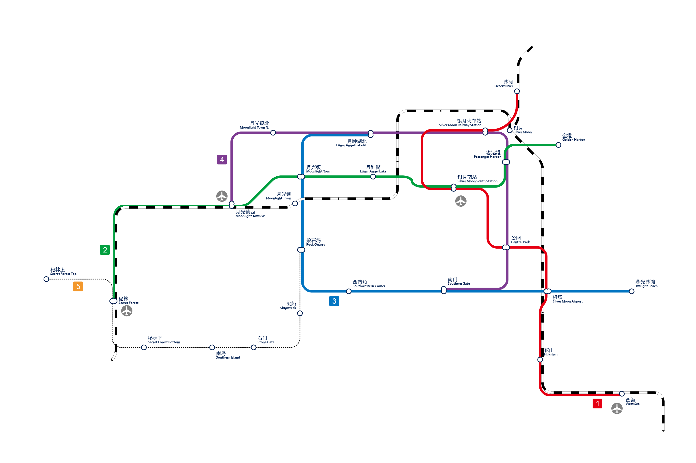

# 北境

## 概述

- 北境城（通称北境，英文 Northern Area/N.A.）是位于[新光](xinguang.md)西北的一座建设中的城市，以一片完全新建的海港为中心向内陆方向西拓，目前的发展方向为以旅游业和商业为主，重轻工业为辅。
- 北境的建设愿景是成为「新光级的大城」，未来视情况可能升为市，也有发展为新光建成以后的第二大主城的希望。
- 和新光一样，北境实行公有制。北境的资源共享区域位于银月区银月客运港西。
  > 在新光境内，实行公有制，所有玩家都可以任取城镇内的资源（不包括管制资源和未明确说明「资源可自取」的住宅内的资源）。但所有玩家也应当有自觉意识，例如不得过多取走珍贵物资。在新光境内生活的玩家们应当持有分享开放精神。

## 历史

- 北境的始建者暨第一任地委书记为 @Demonioron (De)，大约于 2023 年 5~6 月间加入测试群并随后进入生存服，提出「密林谷」的建设计划并最终得以实施，建设过程中逐渐扩展并更名为北境。但此人曾多次对群集体有一定攻击性发言，现已被驱逐。
- 北境目前的地委书记是 @巴豆 和 @比翼鸟，后者于 2023 年 8 月 3 日开始接手北境建设。**当前北境的各项目建设，原则上均应与以上二人之一事先声明方可进行。**

## 行政区划

### 银月区 (Silver Moon District)

- 北境的中心城区，住宅区、工业区和交通设施均集中于此地。
- 削平了一片靠海的高地后建造起来的港口城市，目前包含两座大型工厂、四座住宅、火车站、客运港和一座港口。

### 月光区 (Moonlight District)

- 北境的老城区，历史曾用名有「月光村」「月神村」「银月区」。现阶段处于再开发预备时期。
- 是一座村庄，原有村民已全数搬迁至银月区。未来计划将此地改建为农贸市场和农家乐园区，并建造民宿。
- 现时尚无良好的交通接驳，只有土路。
- 月神湖景区亦属于此处。
- 巴豆兴建的彩印厂位于公园西侧，归月光区管辖。

### 秘林区 (Secret Forest District)

- 北境城的西郊区，原名「密林谷」。
- 已经初步建成，未来将以 RPG 主题乐园的形式投入运营。

## 主要建筑

### 银月火车站

由 De 建设，1、2 站台为港湾式站台，分别为北矿线和规划中北原线的终点站；3、4 站台计划建设为侧式站台，为建设中的北岩线的终点站。

### 银月客运港

由 De 建设，纯粹的客运用途的海港，目前开行「银月 — 新光」北港的航线。北侧有观光灯塔。

### 工厂

- 一厂为刷石机工厂。
- 二厂有三层，一层为自动化农场，二层为炼油厂（无限岩浆源），三层为两台自动化转炉。
- 三厂建设中。

### 公园

位于城南，一个平凡的小公园。

### 艾露恩机场  

由比翼鸟承建的机场，计划提供向新光、矿山、雪原等地的航班服务。

## 重点工程

### 地形修复

目前银月区已开发地带和原有自然地形之间并无过渡地形，一刀切的高地断面严重影响市容，因此需要修整这些断崖地形以使得地形平滑。
    
### 三个现代化计划

即北境的工业现代化、商业现代化和交通设施现代化。
- **工业现代化**：三座现代化工厂——食品厂、钢厂和量产机工厂；
- **商业现代化**：城西片区的大型商业建筑群及南部空港新城的开发；
- **交通设施现代化**：依靠传统铁路（银月火车站）、城市铁路及现代化公路实现北境的交通现代化，同时构建海（银月客运港）陆（北矿线、北岩线、北原线）空（银月艾露恩机场）下界四维立体的长途客运走廊。

## 铁路规划

- **1 号线**：沙上 — 西海，「机场（不含） — 西海」贯通国铁北矿线，在沙上站/银月北线路所接入北原线，共 7 站；
- **2 号线**：金港 — 秘林，「月光镇（不含） — 秘林」段贯通国铁北岩线，共 7 站；
- **3 号线**：月神湖北 — 暮光沙滩，「南门 — 月神湖北」段与 4 号线建设联络线成环线，共 7 站；
- **4 号线**：月光村西 — 南门，「月神湖北 — 南门」段与 3 号线建设联络线成环线，共 7 站;
- **5 号线**：采石场 — 秘林上，远景规划线路，单线路面有轨电车，共 7 站。

