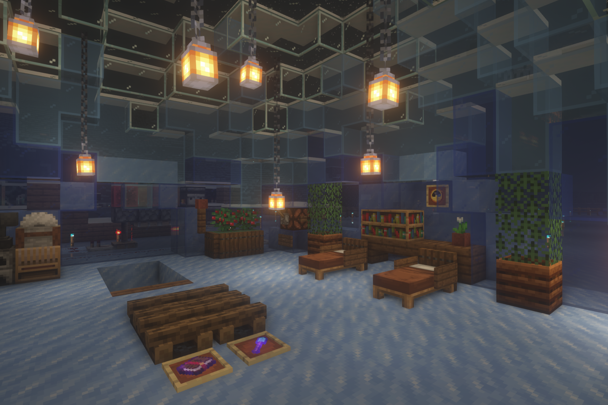

# 雪原

## 概述

- 欢迎来到西伯利亚！（大雾）  
  雪原（英文名 Snowfield）是生存服第二个建立驿站的地区，但一直没什么人来挖土豆，就算是刷冰场建立之后这里依旧冷冷清清（不愧是西伯利亚）。
- 在冰块采掘业的引领下雪原成为了生存服第四个独立区域。出于对此地优美雪景的保护，这里的建筑原则是因地制宜，适应环境。目前不打算进一步开发，仅以生态修复为主。生态修复完成后将开发旅游业，适当建立居所。等到村民交易大改在生存服落实时，雪原将可能承建雪原和针叶林村民交易所。
- 雪原特产：云杉、雪狐狸、红狐狸、各种冰、细雪 ~~、北极熊、流浪者~~
- 你知道吗：@Ar 可能在这里挖了好几大箱子的蓝冰。特别感谢。

## 主要建筑

### 雪原驿站

由 @绿叶 设计。  
舒适温暖的基地。

### 刷冰场

- 刷冰场控制室 & 雪原科考站 & 雪屋主体由 @鸽子 设计；红石电路由 @南瓜汁 设计；@绿叶 参与美化；特别感谢 @小鼠 在刷冰场建设过程中提供的帮助。
- 原型机位于[矿山区域](the_diggings.md)，但由于矿山刷冰场积雪区域过小，效率较低，因此在雪原另建了一个刷冰场。与原型机相比，雪原刷冰场规模更大，集成性更好，也更美观。
- 科考站设计灵感为因纽特人的雪屋，室内设计兼顾实用性与美观性，可完全控制刷冰场、进入刷冰场下方空间进行采掘、储存各类冰、满足临时居住的需求和欣赏雪景。为了保证刷冰场的美观性红石电路几乎全部在冰面之下，南瓜汁的工作量和工作难度大大增加，但最终效果令人相当满意。在此对南瓜汁的帮助表示感谢。
- 科考站前方是由绿叶设计的「意义不明的装饰」（本人说法），实测可以跑酷。
- *热知识：刷冰场的水未结冰时可以生成一定量的鲑鱼，非常原生态。但如何利用好这份资源依旧是一个难题。*

### 刷雪机

由 @小鼠 设计。  
可以制造雪球。拉杆朝下为关，朝上为开。

### 双人游戏装置

由 @巴豆 设计。  
穿着皮革靴子分别站在两侧的细雪平台上，用弓射掉对方脚下的细雪方块，落地即失败。  
不过此装置不太满足因地制宜的原则，正在考虑重建。