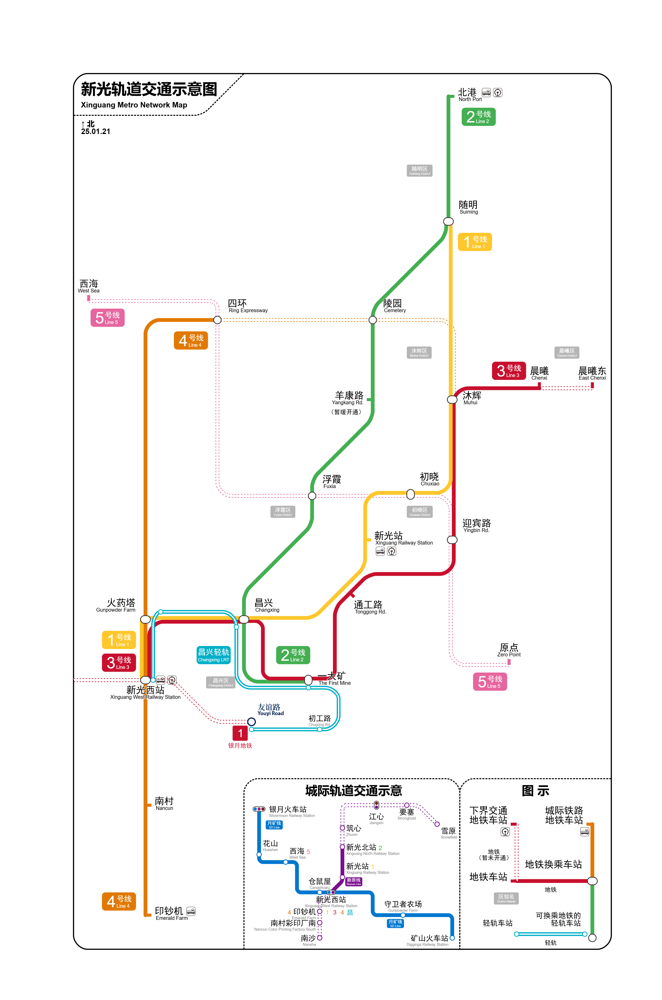

# 新光

## 概述

- 新光镇（在大多数情况下省略其规模而称为「新光」）是全服第一个城镇，所有玩家的出生点即在此地。新光镇由若干大岛组成，四周临海，全城呈「J」型发展。根据不同区域的职能规划不同，分为六区：初晓区、昌兴区、沐辉区、随明区、晨曦区和浮霞区。「新光镇」未来可能会因规模增大而改称「新光市」。
- 在新光境内，实行公有制，所有玩家都可以任取城镇内的资源（不包括管制资源和未明确说明「资源可自取」的住宅内的资源）。但所有玩家也应当有自觉意识，例如不得过多取走珍贵物资。在新光境内生活的玩家们应当持有分享开放精神。
- 在新光境内建造一切建筑之前，必须申请并报备所需占用的土地位置和面积。

## 主要区划

### 初晓区

- 初晓区是新光镇主城区，是居住地和工作场所的主要聚集地，也是玩家出生点的所在地。初晓区的区划为出生点所在的大岛。
- 主要道路包括一环、二环、中央大街、迎宾路、工农路等。
- 主要建筑和地点包括多数成员的民居、出生点、仓库、新光站（在建）、屠龙纪念塔、染坊（艺术馆）、图书馆、餐厅、临时牧场、临时农场等。

### 昌兴区

- 昌兴区是新光镇工业区，是全服重要原材料和生电机器的主要聚集地。昌兴区的区划为初晓区南部的大岛。
- 主要道路包括金交街、初工路和一大矿大道。
- 主要建筑和地点包括猪人塔、村交所、火药塔、刷铁机、新光西站（在建）、临时住所、一大矿、三大转炉、海带机、甘蔗机、史莱姆区块等。

### 沐辉区

- 沐辉区是新光镇较北部发展中区域，此处有全服门类最齐全、规模面积最大的林场，以及一个在建中的墓园。沐辉区的区划为初晓区北部的大岛。
- 主要道路包括林场路、沐辉路（北三环）、中央北大桥。
- 主要建筑和地点包括林场和墓园。

### 浮霞区

- 浮霞区是新光镇西部海域区域，此处计划建成全服第一号可发展空岛和海域设施。浮霞区的区划为初晓区西部的海域区域。
- 主要道路包括浮霞一路。
- 主要建筑和地点包括空岛和游乐园。

### 随明区

- 随明区是新光镇北部区域，此处计划建成新光最大动物园、牧场以及集成牧业相关工业机器。
- 当前仍处于规划状态，尚未开始建设。预计初晓区的临时牧场将迁移到此处。
- 主要建筑和地点包括动物园（待建）、新牧场（待建）、随明工业区（待建）和北港口（待修整）。

### 晨曦区

- 晨曦区处于沐辉区东侧的岛上，此处计划建成新光大农场以及相关工业设施。
- 当前仍处于规划状态，尚未开始建设。预计初晓区二环外的农场将迁移到此处。
- 主要建筑和地点包括农场、晨曦工业区和部分民居。

## 主要道路

初晓区有大量的路牌指示玩家东西南北方向和路名地名，但这可能造成性能骤降。*~~已经造成性能骤降了 (恼)~~*

### 一环路

| 路名 | 信标路（东一环） | 上泽路（西一环） | 一环南路（南一环） | 原村路（北一环） |
| --- | --- | --- | --- | --- |
| 走向 | 南北 | 南北 | 东西 | 东西 |

### 二环路

| 路名 | 通工路（东二环） | 一大矿大道高架（西二环） | 通工路（南二环） | 一大矿大路（北二环） |
| --- | --- | --- | --- | --- |
| 走向 | 南北 | 南北 | 东西 | 东西 |

## 主要建筑和地点

### 出生点

- 是所有玩家的出生点
- 位于初晓区 — 通工路（东二环）和迎宾路的交叉路口

### 仓库

- 存储新光的大部分物资
- 非管制物资可任取，但不得一次取完；存物品请一律存到仓库门口的箱子里（除非你非常明确什么东西该存放在什么地方）
- 位于初晓区 - 迎宾路（镇中心区域）

### 新光站

- 是新光的下界交通站台，同时拥有地铁站和火车站可供出行
- 目前仍处于在建状态，但地铁站（的 1 号线）已经投入使用

## 铁路规划

