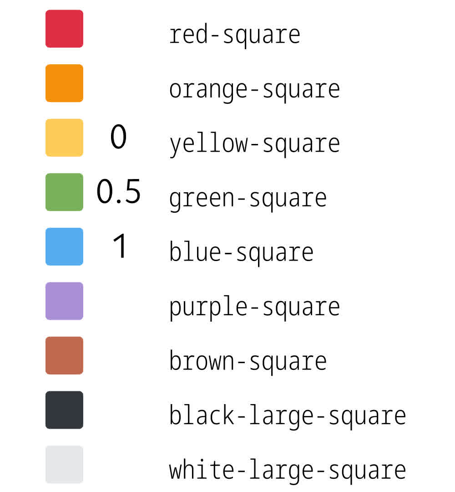
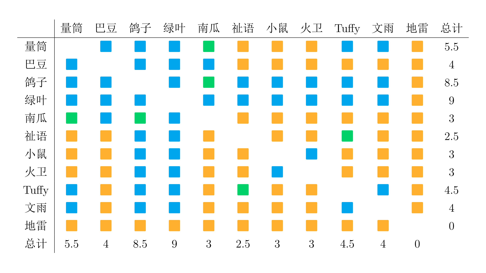
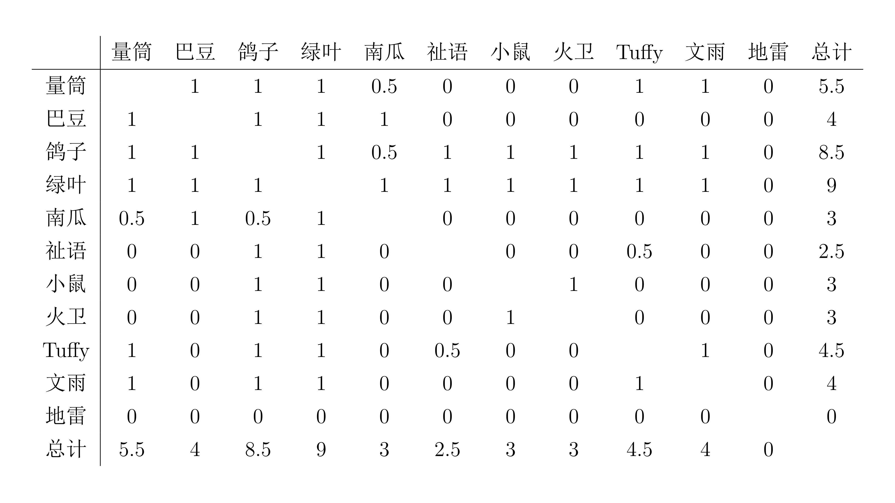

# 面基进度

> 面基学第一定律：面基只有零次和无数次，除非某次面基不愉快。  
  面基学第二定律：当和某人或者某群人面基十分愉快时，会产生和 TA 或者 TA 们再次面基的意愿。  
  面基学第三定律：面基行为具有感染性。一个人的面基行为会鼓动身边的人进行面基。

## 管理员团队面基进度表

### 图例

- 黄色🟨/0：尚未线下面基，也尚未给对方看过自己照片  
- 绿色🟩/0.5：尚未线下面基，但互相主动给对方看过自己的照片  
- 蓝色🟦/1：已经线下面基

颜色描述来源于 Unicode 对该 emoji 的描述，亦即无色盲色弱者所看到的颜色。

### 上色版

> 图表中的颜色使用 emoji 实现。  
  考虑到色觉障碍问题，此处的上色版图表弃用了原有的「红黄绿」配色方案，改为使用「黄绿蓝」配色方案。  
  然而，这种配色方案对于全色盲等特殊情况来说仍存在问题。如果您在查看本图表时无法(轻易)分辨出三种颜色，请查看下方的黑白版(或称数字版)图表。两者数据完全相同，只是表现形式不同。

### 黑白版 (数字版)

## 其余群友面基进度

## 参考内容

为更好理解色觉障碍者眼中的世界，我们参考了以下资料&使用了以下工具：

- Microsoft Edge & Mozilla Firefox 的开发者工具
- [Coblis](https://www.color-blindness.com/coblis-color-blindness-simulator/)
- [WCAG 2.2 相关条目](https://www.w3.org/WAI/WCAG22/Understanding/use-of-color.html)
- [Color Universal Design](https://jfly.uni-koeln.de/color/)
- [听色盲者聊聊五彩斑斓的世界 - sspai](https://sspai.com/post/73698)
