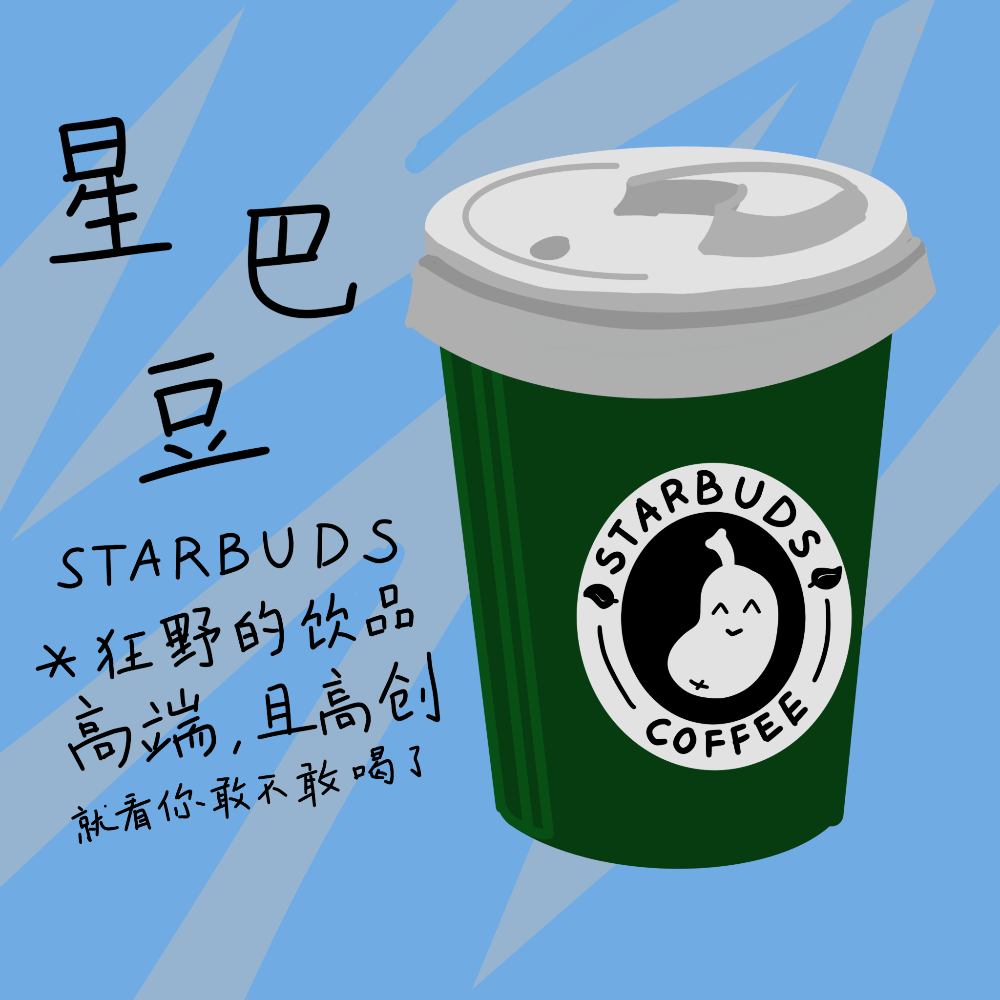
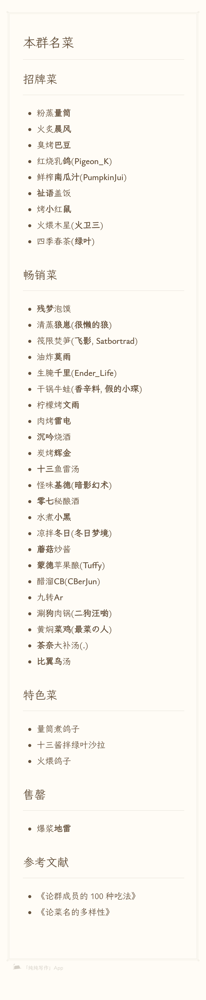

# 本群名菜

## 招牌菜

- 粉蒸**量筒**
- 火炙**晨风**
- 爆浆**地雷**(浆指薄荷糖浆)
- 臭烤**巴豆**
- 红烧乳**鸽**(**Pigeon_K**)
- 鲜榨**南瓜汁**(**PumpkinJui**)
- **祉语**盖饭
- 烤**小**红**鼠**
- 火煨木星(**火卫三**，**AnimalChalk2526**)
- 四季春茶(**绿叶**)
- **蒙德**苹果酿(**Tuffy**)
- 柠檬烤**文雨**

## 畅销菜

- 清蒸**狼崽**(**很懒的狼**)
- **残梦**泡馍
- 生腌**千里**(**Ender_Life**)
- 油炸**莫雨**
- 筏限焚笋(**飞影**, **Satbortrad**)
- **十三**鱼雷汤
- **沉吟**烧酒
- **基岩**打年糕
- 干锅牛蛙(**香辛料**, **假的小琛**)
- **比翼鸟**汤
- 肉烤**雷电**
- 炭烤**辉金**
- 怪味**基德**(**暗影幻术**)
- **零七**秘酿酒
- 杏仁**薏**米粥(**小意**)
- 水煮**小黑**
- 凉拌**冬日**(**冬日梦境**)
- **蘑菇**炒酱
- 醋溜**CB**(**CBerJun**)
- 九转**Ar**
- **帕**派肉丝
- 涮**狗**肉锅(**二狗汪喲**)
- 黄焖**菜鸡**(**最菜の人**，**菜鸡蛛**)
- **茶奈**大补汤
- **卒**笋炒肉(**小卒**)

## 特色菜

- 五量叶（薄荷菲士，薄荷指地雷）
- 星巴豆
- 量筒煮鸽子
- 十三酱拌绿叶沙拉
- 火煨鸽子
- 牛蛙南瓜汁
- 南瓜桑葚鸽子汤  
  注：使用量筒盛装，配芝麻糊(祉语)和茶(君茶)
- 文火炖鸽子

> 鸽子：为什么我到哪里都是被迫害的对象  
  ：哇，是鸽子！  
  ：是炖了好还是煮了好？  
  ：都不好，还得是煨出来的好！  
  ：我要吃红烧的！  
  ：你算老几啊，别听他的，就清蒸好了！  
  ：别吵了，我觉得不如做个汤大家一起喝！  
  ：同意！  
  ：诶，鸽子哪去了？  
  ：到手的鸽子怎么能飞了，大家一起去抓回来！  
  （众人离去）  
  ……  
  南瓜：所以，被迫害得多总是有原因的（安详  
  （鸽子：不用小心对待我 请用心对待我就可以）

## 宣传图

### 粉蒸量筒 by @巴豆 & @南瓜汁 & @量筒

<video controls>
<source src="../assets/menu/fenzhenglt.mp4" type="video/mp4">
当前浏览器不支持使用视频播放控件。
</video>

### 五量叶 by @文雨

### 星巴豆 by @文雨

## 参考文献

- 《论群成员的 100 种吃法》
- 《论菜名的多样性》

